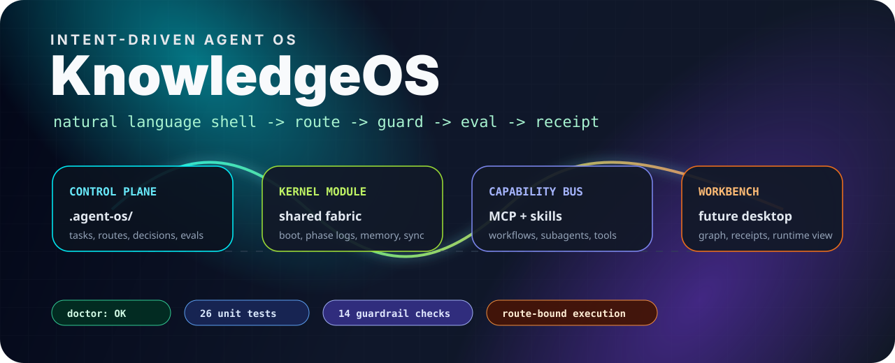
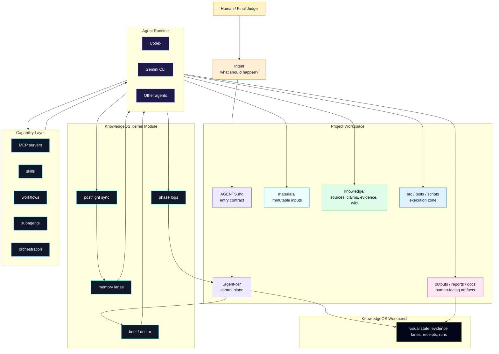

<div align="center">

# KnowledgeOS

### An intent-driven operating layer for AI agents, knowledge work, and software development.

[](docs/LIVE-REPORT.md)
[](docs/agentos-architecture.md)
[](docs/executable-control-plane.md)
[](docs/route-bound-execution-guard.md)
[](docs/capability-orchestration.md)
[](examples/scenarios)



**Natural language is the shell.**<br>
**`.agent-os/` is the control plane.**<br>
**The shared-fabric kernel records boot, phase, memory, and sync.**<br>
**The capability layer routes MCP, skills, workflows, and subagents.**

</div>

---

**Navigate:** [Architecture](docs/agentos-architecture.md) | [Quickstart](docs/quickstart.md) | [CLI](docs/executable-control-plane.md) | [Guardrails](docs/doctor-guardrails.md) | [Router](docs/workflow-router.md) | [Tool Registry](docs/tool-registry.md) | [Reset + Migration](docs/reset-and-migration.md) | [Archive Policy](docs/archive-policy.md)

---

## Download Workbench

KnowledgeOS Workbench is the packaged macOS desktop app for inspecting KnowledgeOS projects.

- **Apple Silicon DMG:** [KnowledgeOS-Workbench-0.1.0-arm64.dmg](https://github.com/Fly-Carrot/KnowledgeOS/releases/download/v0.1.0/KnowledgeOS-Workbench-0.1.0-arm64.dmg)
- **Apple Silicon ZIP:** [KnowledgeOS-Workbench-0.1.0-arm64.zip](https://github.com/Fly-Carrot/KnowledgeOS/releases/download/v0.1.0/KnowledgeOS-Workbench-0.1.0-arm64.zip)
- **Checksums:** [SHA256SUMS.txt](https://github.com/Fly-Carrot/KnowledgeOS/releases/download/v0.1.0/SHA256SUMS.txt)

The app bundles the KnowledgeOS kernel and opens a local read-only bridge on `127.0.0.1`. It is an observation layer for routes, receipts, runs, evidence, and knowledge cards; it does not expose a raw shell, model execution, or project mutation endpoint.

This first public build is ad-hoc signed and not notarized. On macOS, use **Right click -> Open** the first time if Gatekeeper warns about an unidentified developer.

---

## The Short Version

KnowledgeOS turns an ordinary project folder into an **observable agent workspace**.

Instead of letting an AI agent improvise from chat memory, KnowledgeOS gives every project a small operating layer:

- a project control plane under `.agent-os/`;
- a fixed lifecycle for tasks, routes, runs, evals, receipts, and handoffs;
- a write guard that protects raw materials and sensitive paths;
- a cold archive policy for historical files that should be stored but not read by default;
- a capability bus for MCP servers, skills, workflows, subagents, and orchestrators;
- a kernel module for boot discipline, phase logs, memory lanes, and postflight sync;
- a future-ready workbench model for visualizing the whole system.

The philosophy is simple:

> Classifications can stay extensible. The lifecycle must stay fixed.

---

## System Map



---

## Why This Feels Like An OS

Most agent workflows are powerful but loose. They can read files, write code, call tools, summarize papers, and draft reports, but they often lack the basic operating discipline that normal computers rely on.

KnowledgeOS adds that missing discipline:

| OS idea | KnowledgeOS equivalent | What it gives agents |
|---|---|---|
| Shell | Natural language intent | A human-friendly command surface |
| System calls | `knowledgeos` CLI | Deterministic operations with evidence |
| Process state | `.agent-os/tasks.yaml` and runs | Task lifecycle and run receipts |
| File permissions | write policy and route guard | Dirty-write prevention |
| Drivers | capability layer | MCP, skills, workflows, subagents |
| Kernel logs | phase logs and receipts | Observable work history |
| Mount table | workspace and fabric links | Project-to-kernel connectivity |
| Desktop | KnowledgeOS Workbench | Visual inspection and trust-building |

This is not a replacement for macOS, VS Code, the terminal, Obsidian, Codex, Gemini CLI, or MCP. It is the control layer that lets them behave like one auditable agent system.

---

## Core Flow

```text
intent
  -> context loading
  -> doctor
  -> route
  -> dispatch
  -> write guard
  -> run envelope
  -> eval
  -> complete
  -> receipt
  -> postflight sync
```

Every meaningful task should leave evidence. No invisible success claims, no silent route changes, no untracked output sprawl.

---

## Quick Start

Run the low-token health check:

```bash
./bin/knowledgeos doctor --root . --project-root . --summary
```

Create a clean KnowledgeOS runtime in another location:

```bash
./bin/knowledgeos init-os --os-root /path/to/KnowledgeOSRuntime
```

Initialize an existing project folder:

```bash
./bin/knowledgeos init-project --project-root /path/to/project --name "My Project"
```

Route and execute a task with evidence:

```bash
./bin/knowledgeos route-task --project-root /path/to/project --task-id T001
./bin/knowledgeos dispatch-task --project-root /path/to/project --task-id T001
./bin/knowledgeos check-route-write --project-root /path/to/project --task-id T001 --path docs/plan.md
./bin/knowledgeos run-task --project-root /path/to/project --task-id T001
./bin/knowledgeos context-pack --project-root /path/to/project --task-id T001 --run-id RUN-...
./bin/knowledgeos plan-task --project-root /path/to/project --task-id T001 --run-id RUN-... --summary "Task plan."
./bin/knowledgeos eval-task --project-root /path/to/project --task-id T001 --run-id RUN-...
./bin/knowledgeos verify-context --project-root /path/to/project --task-id T001 --run-id RUN-...
./bin/knowledgeos verify-lifecycle --project-root /path/to/project --task-id T001 --run-id RUN-...
./bin/knowledgeos complete-task --project-root /path/to/project --task-id T001 --run-id RUN-... --summary "Task complete."
```

For old projects, generate a safe migration plan before moving files:

```bash
./bin/knowledgeos migrate-legacy-project --project-root /path/to/project --write-plan
```

For project reset and recovery:

```bash
./bin/knowledgeos reset-project --project-root /path/to/project --mode soft --dry-run
./bin/knowledgeos reopen-task --project-root /path/to/project --task-id T001 --reason "Rerun required."
```

---

## What Is In The Repository

```text
.agent-os/                  local KnowledgeOS control-plane example
bin/knowledgeos             CLI entrypoint
knowledgeos/                Python implementation
examples/scenarios/         distracted-agent guardrail tests
templates/governance-core/  minimal kernel module template
templates/capability-layer/ MCP, skills, workflows, subagents, agents, registries
templates/project-control-plane/ project bootstrap template
templates/project-control-plane/archive/ cold-storage convention for superseded project material
docs/                       architecture, guardrails, routing, reset, orchestration
```

The public repository intentionally excludes local runtime history, personal paths, private generated capability content, and machine-specific receipts.

---

## Verified Guardrails

```bash
make doctor
make doctor-summary
make route
make tools
make dispatch
make guard
make scenarios
make test
make smoke
```

Current checked baseline:

- `doctor --summary`: 389 checks passing in the local project.
- Clean public export: 371 checks passing outside the original working tree.
- Unit tests: 26 passing.
- Guardrail scenarios: 14 checkpoints passing.

The scenario suite verifies that distracted-agent mistakes are blocked by doctor, route, write, dispatch, and eval gates.

---

## Read Next

- [AgentOS Architecture](docs/agentos-architecture.md)
- [Quickstart](docs/quickstart.md)
- [Executable Control Plane](docs/executable-control-plane.md)
- [Doctor Guardrails](docs/doctor-guardrails.md)
- [Workflow Router](docs/workflow-router.md)
- [Tool Registry](docs/tool-registry.md)
- [Route-Bound Execution Guard](docs/route-bound-execution-guard.md)
- [Capability-Oriented Orchestration](docs/capability-orchestration.md)
- [Reset And Legacy Migration](docs/reset-and-migration.md)
- [Cold Archive Policy](docs/archive-policy.md)

---

## Project Status

KnowledgeOS is a working prototype and design manifesto for turning AI-agent workspaces into governed, inspectable systems. The current focus is the **knowledge + development AgentOS** form: a system for research writing, literature synthesis, grant drafting, codebase maintenance, reproducible analysis, project migration, and long-horizon agentic development.

KnowledgeOS Workbench is the current visual desktop for this OS layer: not the source of truth, but the place where humans inspect routes, receipts, artifacts, memory, graph state, and agent decisions. Download the packaged macOS app from the GitHub Release; generated desktop binaries live in Releases, not in the source tree.
