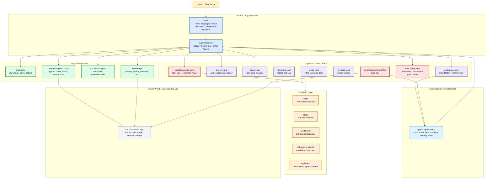
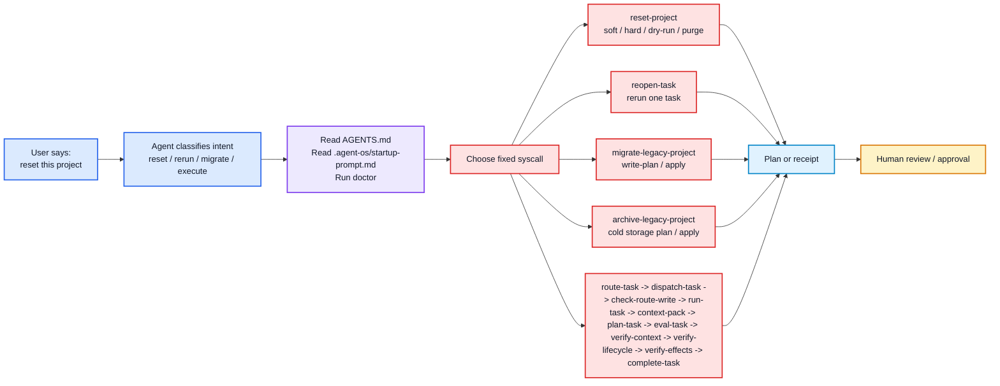
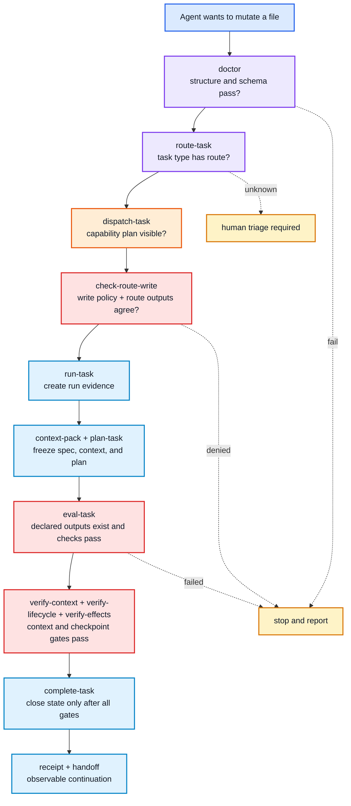

# KnowledgeOS: Turning Agents Into An Operating System For Knowledge Work


KnowledgeOS is an **intent-driven operating layer for AI-assisted knowledge work and software development**.

It is not another chat UI. It is not a replacement for macOS, VS Code, the terminal, Obsidian, Codex, Gemini CLI, MCP, or local skills. KnowledgeOS is the missing control plane that lets those tools behave like one observable, auditable, and resettable agent system.

The practical idea is simple:

> Natural language is the shell.
> KnowledgeOS CLI commands are the system calls.
> `.agent-os/` is the project control plane.
> `global-agent-fabric/` is the kernel module.
> `capability-layer/` is the driver and tool layer.
> Future workbench apps are desktops that visualize the state.

KnowledgeOS is designed for people who ask AI agents to do long-running, multi-step work: research writing, literature synthesis, grant drafting, codebase maintenance, reproducible analysis, project migration, and agentic software development.

## Why This Exists

Most AI agents are powerful but fragile. They can write code, summarize documents, call tools, and generate reports, but they often lack the operating discipline that normal computing systems take for granted:

- Where is the current project state?
- Which files are raw evidence and should not be edited?
- Which task is the agent actually doing?
- Which workflow should be used for this task type?
- Which tools, skills, MCP servers, and subagents are allowed?
- What changed, what passed evaluation, and what needs human review?
- How do we reset a bad run without dirtying the project forever?
- How do we migrate an old messy project into a clean agent-ready structure?

KnowledgeOS turns these questions into files, policies, and executable checks.

The design is related to the spirit of projects such as [LLM Wiki](https://llm-wiki.net/), which treats Markdown knowledge bases and `AGENTS.md` instructions as a way for agents to accumulate and query durable knowledge. KnowledgeOS extends that idea from **knowledge memory** into a broader **operating harness**: tasks, routes, permissions, evals, receipts, tool registries, reset, and migration.

## Product Positioning

KnowledgeOS is a **knowledge and development AgentOS**.

It focuses on two high-value workloads:

- **Knowledge work**: turning materials into sources, claims, evidence, methods, concepts, wiki pages, reports, and reusable project guidance.
- **Development work**: letting agents modify code, run tests, record diffs, produce receipts, and stop before risky or ambiguous steps.

The goal is not to make agents more magical. The goal is to make them more **operable**.

A good operating system does not merely execute instructions. It manages files, permissions, processes, devices, state, errors, and recovery. KnowledgeOS applies the same spirit to AI agents.

## Color Layer Architecture



## The Operating-System Analogy

| Classical OS Idea | KnowledgeOS Equivalent | What It Gives Agents |
| --- | --- | --- |
| Shell | Natural language prompt | A human-friendly way to express intent |
| Syscall | `knowledgeos` CLI command | A deterministic action boundary |
| Kernel | `global-agent-fabric/` | Boot, phase logs, memory lanes, postflight receipts |
| Process table | `.agent-os/tasks.yaml` and `.agent-os/runs/` | What is running, ready, blocked, or completed |
| Filesystem policy | `.agent-os/read-policy.yaml` and `.agent-os/write-policy.yaml` | Which paths are default context, cold storage, immutable, controlled, or gated |
| Scheduler/router | `.agent-os/workflows/router.yaml` | Which workflow should handle a task type |
| Device drivers | `capability-layer/` | MCP, skills, workflows, subagents, local scripts |
| System log | `.agent-os/receipts/` and `.agent-os/runs/` | Evidence that work happened and was checked |
| Desktop | Future workbench app | Visual monitoring, graph, wiki, terminal, preflight |
| Recovery mode | `reset-project`, `reopen-task`, `archive-legacy-project` | Clean recovery from bad runs, bad project state, or historical context clutter |

This analogy matters because it prevents a common mistake: treating an agent as a single smart text box. In real work, the problem is not only intelligence. The problem is **state, permission, routing, recovery, and evidence**.

## From Natural Language To Fixed Interfaces

KnowledgeOS lets users speak naturally, but it does not let agents perform high-risk actions by improvisation. Natural language is mapped to fixed interfaces.



Example natural-language requests and expected system calls:

| User Intent | Agent Should Call | Why |
| --- | --- | --- |
| "Reset this KnowledgeOS project, but do not delete yet." | `knowledgeos reset-project --project-root . --mode soft --dry-run` | Shows the recovery plan before mutating state |
| "Make this folder unmanaged again." | `knowledgeos reset-project --project-root . --mode hard --dry-run` | Previews removal or archival of the control plane |
| "I dislike the result of task T002; redo it." | `knowledgeos reopen-task --project-root . --task-id T002 --reason "..."` | Reopens one task instead of wiping the whole project |
| "Reorganize this old project into KnowledgeOS structure." | `knowledgeos migrate-legacy-project --project-root . --write-plan` | Produces a review-first migration plan |
| "Now apply the approved migration plan." | `knowledgeos migrate-legacy-project --project-root . --apply` | Moves only confidently classified top-level entries |
| "Move old leftovers out of active context but keep them." | `knowledgeos archive-legacy-project --project-root . --write-plan` | Produces a cold archive plan before moving anything |
| "Write code for this task." | `route-task -> dispatch-task -> check-route-write -> run-task -> context-pack -> plan-task -> eval-task -> verify-context -> verify-lifecycle -> verify-effects -> complete-task` | Prevents blind file mutation and stale context |

## Fixed Lifecycle, Extensible Classification

KnowledgeOS uses one fixed lifecycle:

```text
intent -> context -> route -> dispatch -> write guard -> run -> eval -> complete -> receipt -> postflight
```

But task categories can remain extensible. This is the key design principle:

> Classifications can be open. Lifecycle must be fixed.

That means a project can add task types such as `literature_review`, `grant_drafting`, `data_cleaning`, `frontend_build`, `security_review`, or `paper_revision`, but every task still goes through the same observable gates.

## Default Repository Layout

A clean KnowledgeOS distribution has three major surfaces:

```text
KnowledgeOS/
  README.md
  AGENTS.md
  Makefile
  bin/
  knowledgeos/
  docs/
  examples/
  templates/
  global-agent-fabric/
  capability-layer/
  .agent-os/
  .knowledgeos-local/
```

### Root Files

| Path | Provides | Notes |
| --- | --- | --- |
| `README.md` | Public entrypoint | Short product description, quick commands, docs index |
| `AGENTS.md` | Agent entry contract | Tells Codex/Gemini/other agents how to operate this repository |
| `Makefile` | Common checks | `make doctor`, `make smoke`, `make test`, scenario checks |
| `.gitignore` | Cleanliness boundary | Excludes caches, runtime backups, local-only state |

### `bin/`

| Path | Provides | Notes |
| --- | --- | --- |
| `bin/knowledgeos` | Executable CLI shim | Calls the standard-library Python control plane |

### `knowledgeos/`

| Path | Provides | Notes |
| --- | --- | --- |
| `knowledgeos/cli.py` | The executable control plane | Implements doctor, init, route, dispatch, write guard, run, eval, complete, reset, migration |

This is where the OS becomes real. The docs describe policy; `knowledgeos/cli.py` enforces it.

### `docs/`

| Path | Provides | Notes |
| --- | --- | --- |
| `docs/architecture.md` | Concise architecture | Short internal architecture overview |
| `docs/agentos-architecture.md` | Public architecture manifesto | This GitHub-ready long-form document |
| `docs/executable-control-plane.md` | CLI behavior | Command-level explanation |
| `docs/doctor-guardrails.md` | Health checks | What doctor validates |
| `docs/workflow-router.md` | Task routing | How task types map to workflow profiles |
| `docs/write-guard.md` | Write policy | Immutable, controlled, gated, and unclassified paths |
| `docs/route-bound-execution-guard.md` | Route-bound mutation | Why writes need both write-policy and route approval |
| `docs/capability-orchestration.md` | Tool dispatch | Branch Builder, orchestrator, subagents, MCP, skills, scripts |
| `docs/tool-registry.md` | Tool visibility | How capabilities are indexed and checked |
| `docs/reset-and-migration.md` | Recovery and legacy migration | Reset, reopen, hard reset, migration plan/apply |
| `docs/migration-boundary.md` | Public/local boundary | Keeps public templates separate from private machine state |
| `docs/public-release-checklist.md` | Release hygiene | Checks before publishing |
| `docs/LIVE-REPORT.md` | Build log | Live development report |

### `examples/`

| Path | Provides | Notes |
| --- | --- | --- |
| `examples/scenarios/distracted-agent-guardrails.md` | Human-readable guardrail scenarios | Explains how the system catches inattentive agents |
| `examples/scenarios/run_guardrail_scenarios.sh` | Executable scenario test | Creates temporary projects and verifies blocked mistakes |

The scenario runner is important because it tests behavior, not just file presence.

### `templates/`

| Path | Provides | Notes |
| --- | --- | --- |
| `templates/project-control-plane/` | Project-local `.agent-os/` skeleton | Copied into user projects by `init-project` |
| `templates/governance-core/` | Minimal kernel scaffold | Used by `init-os` to create `global-agent-fabric/` |
| `templates/capability-layer/` | Minimal capability scaffold | Used by `init-os` to create `capability-layer/` |

Templates are the pure public shape. They should avoid personal paths, secrets, local MCP instances, and machine-specific assumptions.

### `global-agent-fabric/`

| Path | Provides | Notes |
| --- | --- | --- |
| `global-agent-fabric/rules/` | Runtime discipline | Shared rules that agents load before acting |
| `global-agent-fabric/hooks/` | Boot, phase, postflight scripts | Minimal shell hooks for `BOOT_OK`, phase logs, and `SYNC_OK` |
| `global-agent-fabric/registries/` | Registry examples | MCP, skills, workflow registry shapes |
| `global-agent-fabric/schemas/` | Contract docs | Phase, memory lane, postflight schemas |
| `global-agent-fabric/memory/` | Memory lanes | Decision, handoff, loop, learning, profile ledgers |
| `global-agent-fabric/sync/` | Receipts and phase logs | Append-only operational evidence |
| `global-agent-fabric/projects/` | Project registry | Optional global project index |
| `global-agent-fabric/skills/` | Generated/shared skill metadata | Kernel-linked skill sources and generated protocols |
| `global-agent-fabric/workflows/` | Shared workflow metadata | Workflow source registry |

This layer is called a kernel module because it handles cross-project operating discipline: boot, phase logging, memory, and postflight synchronization.

### `capability-layer/`

| Path | Provides | Notes |
| --- | --- | --- |
| `capability-layer/mcp/` | MCP server definitions or adapters | External tools and servers |
| `capability-layer/skills/` | Curated reusable skills | Domain methods, writing routines, analysis patterns |
| `capability-layer/workflows/` | Reusable workflow prompts | Standard operating procedures |
| `capability-layer/subagents/` | Specialist agent definitions | Role-specific agent workers |
| `capability-layer/agents/` | Runtime adapters | Runtime-specific integration helpers |
| `capability-layer/registries/` | Capability indexes | Machine-readable capability discovery |

This is the driver layer. It makes capabilities observable before agents invoke them.

### `.agent-os/`

This is the most important folder inside a managed project.

| Path | Provides | Agent Meaning |
| --- | --- | --- |
| `.agent-os/workspace.yaml` | Workspace mount table | What this folder is, where OS modules are mounted, which runtime is active |
| `.agent-os/project.yaml` | Project goal and acceptance | What the project is trying to accomplish |
| `.agent-os/tasks.yaml` | Task state machine | What is ready, active, blocked, completed, or cancelled |
| `.agent-os/decisions.yaml` | Locked decisions | Choices agents should not casually reopen |
| `.agent-os/evals.yaml` | Evaluation profiles | What counts as done for each work type |
| `.agent-os/artifacts.yaml` | Artifact registry | Outputs, provenance, status, dependencies |
| `.agent-os/fabric-link.yaml` | Kernel mount | Connection to `global-agent-fabric/` |
| `.agent-os/capabilities.yaml` | Capability declaration | Project-level capability expectations |
| `.agent-os/dispatch-policy.yaml` | Dispatch order | Branch Builder, orchestrator, subagent, MCP, skill, script, human gate |
| `.agent-os/tool-registry.yaml` | Visible tools | MCP, skills, workflows, orchestrators, subagents |
| `.agent-os/write-policy.yaml` | File safety policy | Immutable, controlled, forbidden, receipt-required paths |
| `.agent-os/workflows/router.yaml` | Task routing | Task type to route order, allowed outputs, eval profile |
| `.agent-os/runs/` | Run envelopes | `run.yaml`, prompt, receipt, diff summary, eval, handoff |
| `.agent-os/receipts/` | Latest and historical receipts | Human-readable operating evidence |
| `.agent-os/handoffs/` | Continuation notes | What the next agent needs to know |
| `.agent-os/inbox/` | Triage zone | Unclassified items and migration plans |
| `.agent-os/startup-prompt.md` | Session boot snippet | Minimal rules to wake an agent into OS mode |

`.agent-os/` is not a content dump. It is the control state of the project.

### `.knowledgeos-local/`

| Path | Provides | Notes |
| --- | --- | --- |
| `.knowledgeos-local/` | Local-only inventories and machine notes | Should not become public product state unless deliberately sanitized |

This is where local migration reports, inventories, and environment-specific notes can live without contaminating public templates.

## Managed Project Layout

A user project managed by KnowledgeOS should look like this:

```text
MyProject/
  AGENTS.md
  .agent-os/
  materials/
    raw/
    notes/
    papers/
    interviews/
    references/
  knowledge/
    sources/
    claims/
    evidence/
    methods/
    concepts/
    wiki/
  src/
  tests/
  notebooks/
  scripts/
  data/
    raw/
    interim/
    processed/
  outputs/
    figures/
    tables/
    models/
    logs/
  reports/
    drafts/
    final/
  docs/
```

Folder semantics:

| Folder | Meaning | Mutation Rule |
| --- | --- | --- |
| `materials/` | Original inputs and references | Raw inputs should be immutable or lightly curated |
| `knowledge/` | Structured extracted knowledge | Agents may build sources, claims, evidence, concepts, wiki |
| `src/` | Project code | Agents may edit through route-bound write checks |
| `tests/` | Verification code | Agents should add or run tests when appropriate |
| `notebooks/` | Exploratory analysis | Useful but should not be the only source of reproducibility |
| `scripts/` | Deterministic commands | Preferred for repeatable analysis and automation |
| `data/` | Data lifecycle | Raw data should be protected; interim/processed can be generated |
| `outputs/` | Machine-generated results | Figures, tables, models, logs |
| `reports/` | Human-facing drafts and finals | Often requires human gate before finalization |
| `docs/` | Project documentation | Architecture, methodology, user guide, grant outline, writing guidance |
| `.agent-os/` | OS control plane | Agents must treat it as structured state, not a scratchpad |

## Core Commands

```bash
# Health check
knowledgeos doctor --project-root . --summary

# Initialize an old or new project
knowledgeos init-project --project-root . --name "My Project"

# Route and execute one task safely
knowledgeos route-task --project-root . --task-id T001
knowledgeos dispatch-task --project-root . --task-id T001
knowledgeos check-route-write --project-root . --task-id T001 --path docs/output.md
knowledgeos run-task --project-root . --task-id T001
knowledgeos context-pack --project-root . --task-id T001 --run-id RUN-...
knowledgeos plan-task --project-root . --task-id T001 --run-id RUN-... --summary "Task plan"
knowledgeos eval-task --project-root . --task-id T001 --run-id RUN-...
knowledgeos verify-context --project-root . --task-id T001 --run-id RUN-...
knowledgeos verify-lifecycle --project-root . --task-id T001 --run-id RUN-...
knowledgeos complete-task --project-root . --task-id T001 --run-id RUN-... --summary "Done"

# Reopen one unsatisfactory task
knowledgeos reopen-task --project-root . --task-id T001 --reason "User rejected draft"

# Reset volatile OS state
knowledgeos reset-project --project-root . --mode soft --dry-run

# Remove project from OS management after review
knowledgeos reset-project --project-root . --mode hard --dry-run

# Plan old-project reorganization
knowledgeos migrate-legacy-project --project-root . --write-plan

# Plan cold archive for historical leftovers
knowledgeos archive-legacy-project --project-root . --write-plan
```

## Safety Model

KnowledgeOS uses layered safety instead of trusting one prompt.



The result is not a perfectly autonomous machine. It is something more useful: an agent system that knows when to stop, show evidence, and ask for human judgment.

## Why A Future Workbench App Matters

A future app can become the Workbench or Desktop for KnowledgeOS.

It should not become the source of truth. It should consume OS outputs:

- `.agent-os/tasks.yaml`
- `.agent-os/runs/`
- `.agent-os/receipts/`
- `.agent-os/handoffs/`
- `knowledge/wiki/`
- `knowledge/sources/`
- `outputs/`
- `global-agent-fabric/sync/`
- `capability-layer/registries/`

A dedicated workbench is useful because agents operate across many files, tools, receipts, routes, and memory lanes. A terminal can execute the OS, but a visual app can make the system easier to inspect, teach, debug, and trust.

The app can show:

- preflight health;
- active task state;
- route and dispatch plans;
- MCP, skills, workflows, subagents;
- wiki and graph views;
- terminal and logs;
- reset and migration dry-runs.

In other words: the Workbench is the visual desktop, but `.agent-os/` remains the operating state.

## What Makes This Different From A Prompt Template

A prompt template can tell an agent what to do. KnowledgeOS gives the agent a system to operate within.

| Prompt Template | KnowledgeOS |
| --- | --- |
| Advisory text | Executable checks |
| Session-local | Project-persistent |
| Easy to ignore | CLI-verified |
| No file policy | Write guard and route guard |
| No recovery model | Reopen, soft reset, hard reset |
| No tool registry | Observable capability layer |
| No eval boundary | Eval required before completion |
| No durable handoff | Receipts, runs, handoffs |

The best agent behavior does not come from longer prompts. It comes from a better operating surface.

## Design Principles

1. **Natural language should initiate work, not replace system boundaries.**
2. **Agents should be proactive, but observable.**
3. **Raw materials should remain protected.**
4. **Task classifications can evolve, but lifecycle gates should stay fixed.**
5. **Every substantial mutation needs route, write, run, eval, and receipt evidence.**
6. **Recovery is a first-class feature, not an afterthought.**
7. **The workbench is a desktop, not the source of truth.**
8. **Knowledge should accumulate as sources, claims, evidence, artifacts, and decisions.**
9. **Capabilities should be registered before they are invoked.**
10. **A good AgentOS helps agents stop and ask better questions.**

## Suggested GitHub Repository Introduction

Short version:

> KnowledgeOS is an intent-driven operating layer for AI agents. It turns natural-language requests into observable workflows with task routing, write guards, capability registries, eval gates, receipts, reset, and legacy project migration.

Long version:

> KnowledgeOS is a project-local control plane and shared kernel pattern for agentic knowledge work and software development. It lets Codex, Gemini CLI, MCP tools, local skills, subagents, and future agent runtimes collaborate through one operating contract without forcing them into one monolithic app. The system is designed to preserve raw evidence, structure knowledge, route work, guard file writes, evaluate outputs, record receipts, and recover cleanly from bad runs.

## References And Adjacent Ideas

- [LLM Wiki](https://llm-wiki.net/) - adjacent idea for agent-readable Markdown knowledge bases and durable project memory.
- [Model Context Protocol](https://modelcontextprotocol.io/) - a common pattern for connecting agents to tools and external context.
- `AGENTS.md`-style runtime instructions - a practical convention for teaching agents how to operate inside a repository.

KnowledgeOS stands on the same broad idea: agents need durable context. Its added claim is that durable context should be paired with **operating controls**: routing, write policy, eval, receipts, capabilities, reset, and migration.
